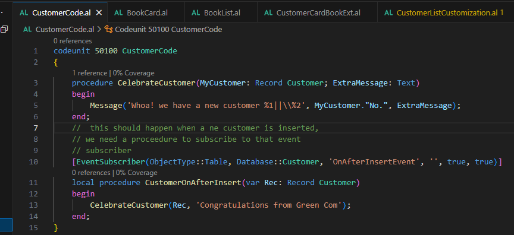
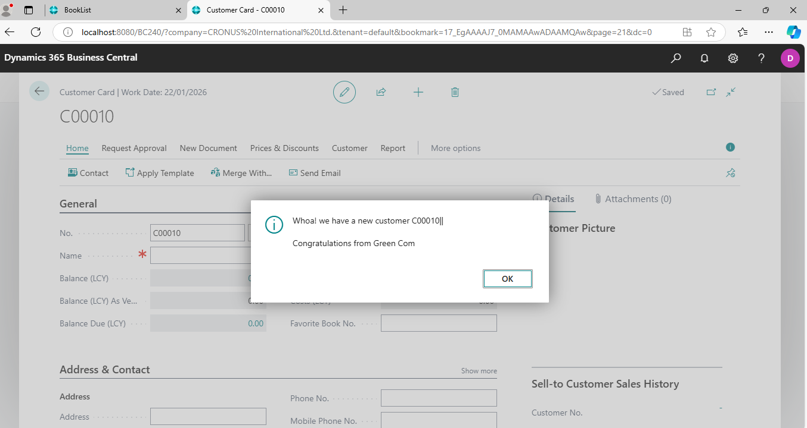
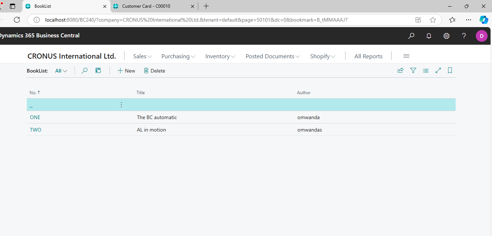
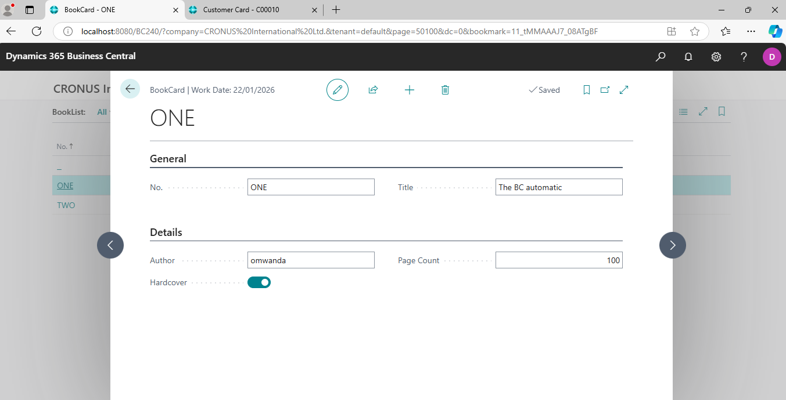
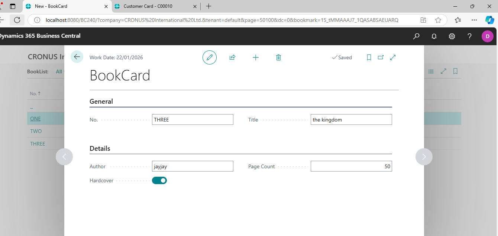

# Project Title

## Description
A procedure is written to give a message when a new customer is added

## Screenshots
Below are some screenshots demonstrating the project:

### Screenshot 1:

### Screenshot 2:

### Screenshot 3:

### Screenshot 3:

## Publishing CTRL+F5

## Usage
Microsoft Dynamic 365 Business Central

